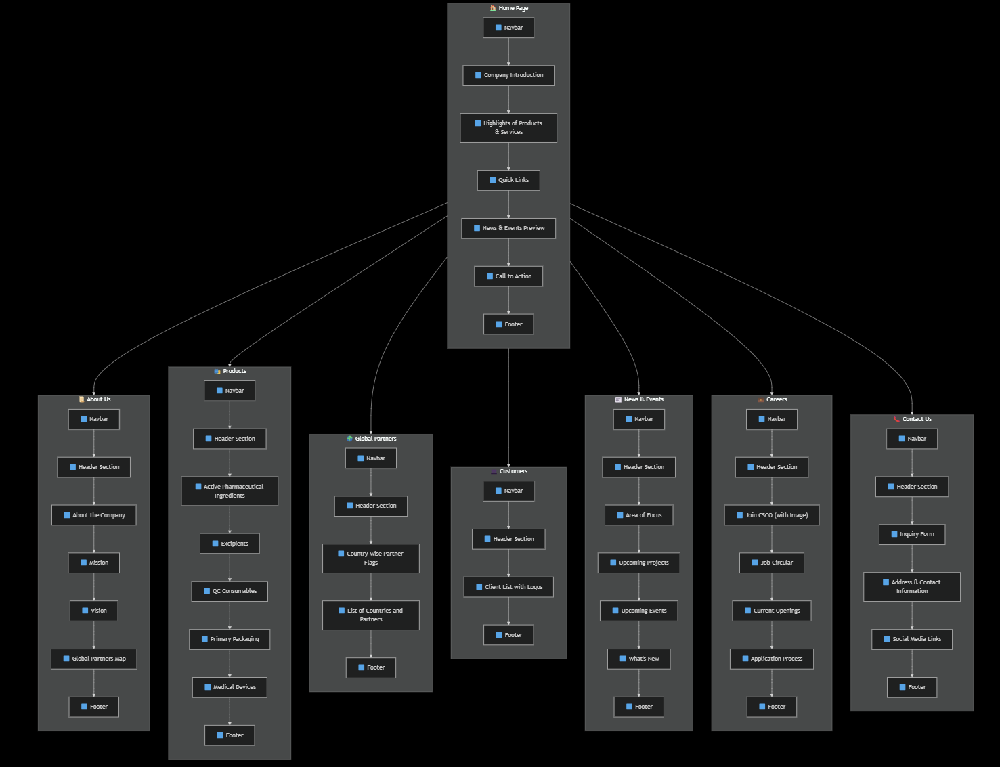
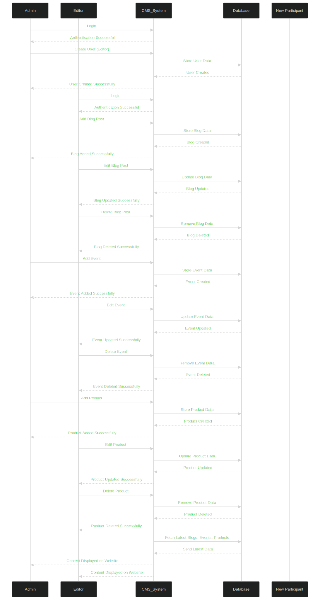
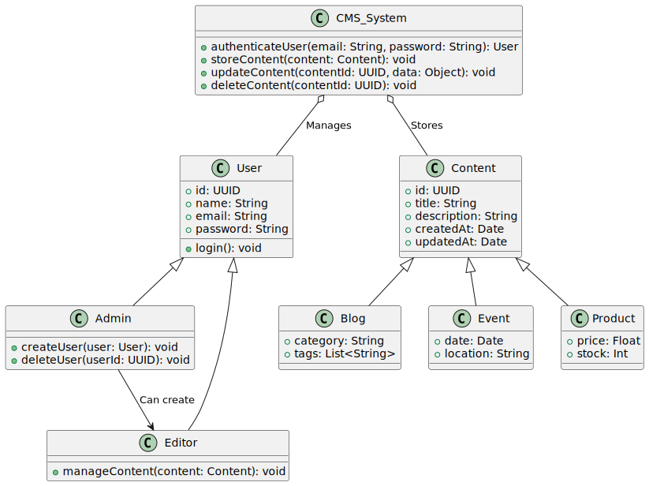

# Website Structure

## 📌 Page-wise Sections

### 1️⃣ Home Page

- **Company Introduction** (Brief summary)
- **Highlights of Products & Services**
- **Quick Links to Key Sections**
  - About
  - Products
  - Partners
  - Customers
  - Careers
- **News & Events Preview**
- **Call to Action**
  - Contact Us
  - Explore Products

### 2️⃣ About Us

#### ➡ About the Company

- Year of incorporation & history
- Overview of business operations
- Industry focus & expertise

#### ➡ Mission

- Customer satisfaction & operational excellence
- Commitment to healthcare & supply chain innovation
- Pharmaceutical supplier hub vision

#### ➡ Vision

- Innovation in supply chain & global trade
- Commitment to quality, transparency, and technology-driven solutions

#### ➡ Global Partners (Map)

- Interactive or static map showing partner locations worldwide

### 3️⃣ Products

#### Active Pharmaceutical Ingredients (API)

- UNITED PHARMA INDUSTRIES CO., LTD (CHINA)
- GLOBE QUIMICA (BRAZIL)
- KINHOO PHARMACEUTICAL CO., LTD (CHINA)
- ZHUHAI UNITED LABORATORIES CO., LTD (HONGKONG)

#### Excipients

- ALPHA GROUP (NETHERLANDS)
- KOEL (INDIA)
- RC ENTERPRISE (INDIA)

#### QC Consumables

- DR. MAISCH (GERMANY)
- DORSAN FILTRATION (SPAIN)
- KARL HECHT GMBH (GERMANY)

#### Primary Packaging

- BOROSIL SCIENTIFIC LIMITED (INDIA)
- SVAM TOYAL PACKAGING INDUSTRIES LTD (INDIA)
- RAVI RAJ FOILS LTD (INDIA)
- SUZHOU CRH NEW MATERIAL TECHNOLOGY CO., LTD (CHINA)
- LIVEO RESEARCH (SINGAPORE)

#### Medical Devices

- PT. ONEJECT (INDONESIA)

### 4️⃣ Global Partners

- **Country-wise Partner Flags**
- List of countries and their associated partners

### 5️⃣ Customers

#### Client List with Logos (if available)

- Eskayef Pharmaceuticals Limited
- Incepta Pharmaceuticals Ltd.
- Popular Pharmaceuticals Ltd.
- Advanced Chemical Industries Limited
- ACME Laboratories Ltd.
- Everest Pharmaceuticals Ltd.
- Beacon Pharmaceuticals Limited
- Nipro JMI Pharma Ltd.

### 6️⃣ News & Events

- **Area of Focus**
- **Upcoming Projects**
- **Upcoming Events**
- **What's New**

### 7️⃣ Careers

- **Join CSCO** (with Image)
- **Job Circular**
- **Current Openings**
- **Application Process**

### 8️⃣ Contact Us (Optional)

- **Inquiry Form**
- **Address & Contact Information**
- **Social Media Links**

# https://documenter.getpostman.com/view/3133402/2sAYdmkTQc
